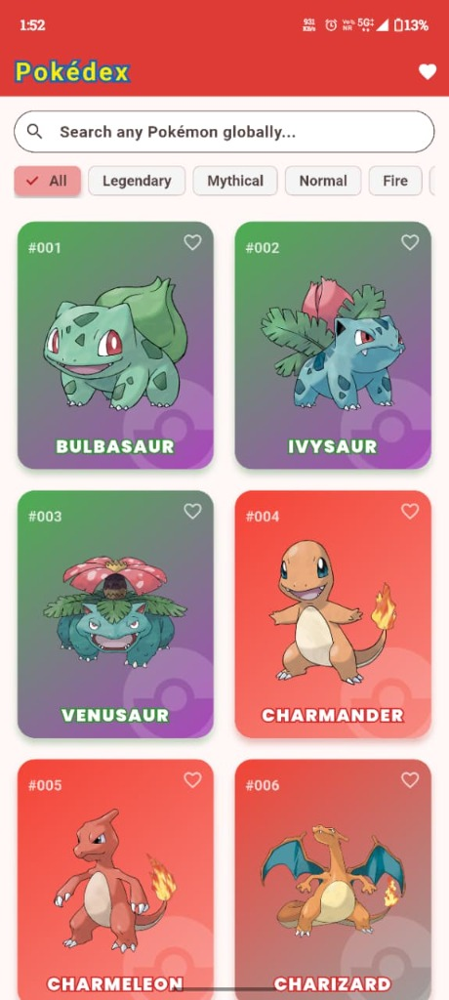
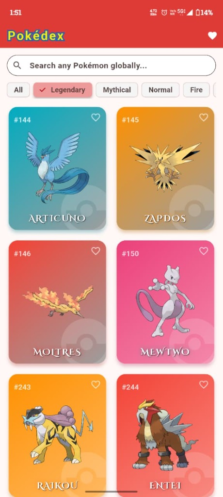
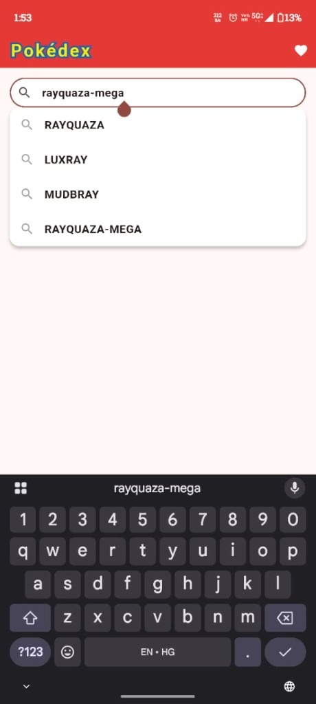
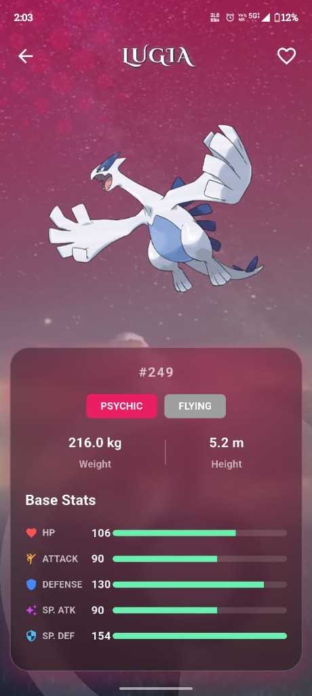
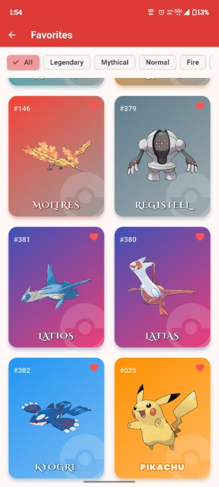

# Ultimate Cross-Platform Pokédex

A stunning, highly performant, and fully cross-platform Pokédex application built with **Flutter**.
This project was designed with premium glassmorphism aesthetics, dynamic elemental animations, and fluid responsive layouts that flawlessly adapt to both Mobile Phones and Desktop Web Browsers using a **single unified codebase**.

## 📸 Mobile App Previews
Here is the mobile application running beautifully in a native environment:

  
  
  
  
  

## 📱 Find the Apps (Mobile vs Web)
Because this app is built with Flutter, the entire application is powered by a **single shared codebase** located in the lib/ directory. However, you can easily build or explore the specific platforms:

* **Mobile App (Android):** 
  * You can instantly download the ready-to-install Android App from the 
eleases/ folder in this repository! Just download **[releases/Pokedex-Android-App.apk]**.
  * The Android-specific configuration files can be found in the ndroid/ directory.
* **Web App:** 
  * The Web-specific configuration files can be found in the web/ directory.
* **Core Logic & UI:** 
  * The beautiful UI, animations, and API logic used by *both* platforms are all securely contained in the lib/ directory.

## ✨ Premium Features
* **Cross-Platform Architecture:** 100% identical features on Mobile Android and Desktop Web.
* **Global Search & Filter:** Instantly search through 1,300+ Pokémon with an autocomplete search bar. Filter by specific types (Fire, Water, Grass, etc.) or by Mythical/Legendary status!
* **Cinematic Elemental Animations:** Tap on any Pokémon to trigger a stunning, full-screen particle animation specific to their elemental type (e.g., Lightning strikes for Electric types, Fire eruptions for Fire types, Water splashes for Water types).
* **Glassmorphism UI:** Beautiful holographic frosted-glass stat cards that dynamically color-match the Pokémon's type.
* **Dynamic Type Matchup Engine:** The stat screen instantly calculates and displays exactly which elements the Pokémon is "Strong Against" and "Weak Against".
* **Persistent Favorites:** Save your favorite Pokémon to a dedicated Favorites tab using local storage (SharedPreferences).
* **Legendary Typography:** Integrated Google Fonts automatically detect Legendary/Mythical Pokémon and style their names in a glowing, premium gold Cinzel Decorative font.

## 🚀 How to Run the Code

### For Web:
1. Open your terminal in the project folder.
2. Run: lutter run -d chrome

### For Mobile (Android):
1. Plug in your Android device via USB (with USB Debugging enabled).
2. Open your terminal in the project folder.
3. Run: lutter run
4. Or, to generate a new APK file yourself, run: lutter build apk --release (The file will be at uild/app/outputs/flutter-apk/app-release.apk).

## 🛠️ Tech Stack
* **Framework:** Flutter / Dart
* **State Management:** Provider
* **API:** PokéAPI (REST)
* **Local Storage:** SharedPreferences